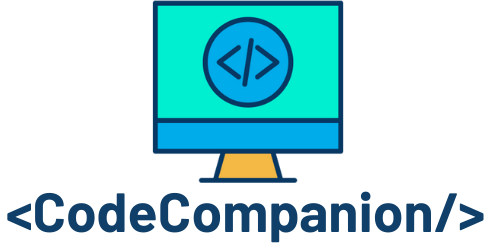
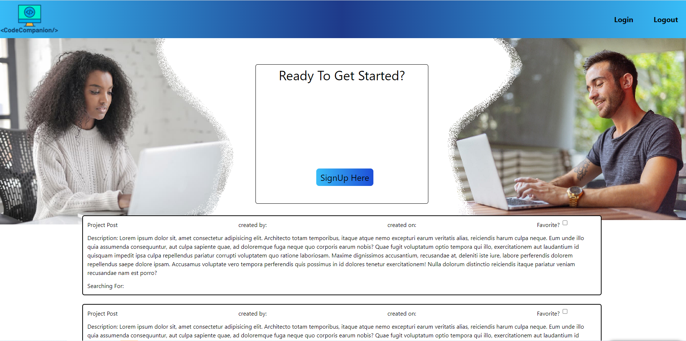

 

# Code  -  Companion

## 🧐 **Description:**

[Code-Companion](https://dashboard.heroku.com/apps) is a web app that allows Users to team up with people around the world to work on coding projects and share their experience. Our application allows you to post projects you are looking for partners on, join projects other users have posted. User's can also build a custom profile which lets them list all of their relevant skills, accomplishments, and years/months of experience. In addition projects also have specifics on skills/experience as well as what language/stack they are using and or looking for.

 

## 🛣️ **Road to Success:**

#

**Challenges;**

- [Auth0](https://auth0.com/why-auth0?utm_content=homepage&utm_source=google&utm_medium=cpc&utm_term=auth0&utm_campaign=amer-usa-search-branded&utm_id=go_cmp-12865209972_adg-123980878280_ad-552575974978_kwd-331982174580_dev-c_ext-_prd-_mca-_sig-Cj0KCQiA0eOPBhCGARIsAFIwTs6PeOZ8wvV2zfpytjwQTZXBxwCKxoPZizymJUrAvFwv3-rnpIccIiIaAnSWEALw_wcB&gclid=Cj0KCQiA0eOPBhCGARIsAFIwTs6PeOZ8wvV2zfpytjwQTZXBxwCKxoPZizymJUrAvFwv3-rnpIccIiIaAnSWEALw_wcB)

                "Auth0" enables access to a single sign-on application that runs on multiple platforms with various identity providers, using JavaScript to power applications. Developers who are using Auth0 can customize stages of the authentication and authorization process, and connect applications and APIs to the database of users and passwords. Developers also maintain the authority to add and remove users as needed through the integration.

 

Initially working with Auth0 was a challenging hurdle on both the Front and Back-End, using a new technology required extra research into Auth0 documentation as well extra time determining as a team how to implement it's uses. One of our intitial struggles was determining the relatiuonship between Auth0 and [MongoDB Atlas](https://cloud.mongodb.com/) on the Back-End. This relationship was far more complicated than expected in regards to our use-case.

 

**Successes;**

- [Auth0](https://auth0.com/why-auth0?utm_content=homepage&utm_source=google&utm_medium=cpc&utm_term=auth0&utm_campaign=amer-usa-search-branded&utm_id=go_cmp-12865209972_adg-123980878280_ad-552575974978_kwd-331982174580_dev-c_ext-_prd-_mca-_sig-Cj0KCQiA0eOPBhCGARIsAFIwTs6PeOZ8wvV2zfpytjwQTZXBxwCKxoPZizymJUrAvFwv3-rnpIccIiIaAnSWEALw_wcB&gclid=Cj0KCQiA0eOPBhCGARIsAFIwTs6PeOZ8wvV2zfpytjwQTZXBxwCKxoPZizymJUrAvFwv3-rnpIccIiIaAnSWEALw_wcB)

Despite our initial struggles with Auth0 as a team we now have a better understanding of it use, as well as gained the experienced of having used a new challenging technology that we were unfirmiliar with initially. In addition to that after working with Auth0 we have a better understanding of the relationship between Front and Back-End through the Auth0 library itself.

- [MongDb Atlas](https://cloud.mongodb.com/)

Working with MongoDb Atlas on the Back-End was simple due to it's user friendly format making it easy to navigate and understand as well as simple to connect to Heroku for deployment. In addition to MongoDb Atlas's ease of use it also features a robust and detailed UI that allows it's users to visualize data and collections.

- [Heroku](https://dashboard.heroku.com)

In terms of Heroku deployment we initially posted with a few errors and issues, however using the Heruko UI and the build logs were able to quickly identify and fix them. Moving forward this benefited us greatly by giving us the ability to visualize and test Front-End opperations.

 

### **User Story:**

 

As a User

        I want a website I can go to as a new or experienced programmer to find people to partner with and work on various coding projects with others.

Then

        I want a list of projects other users are looking for teammates to help create with specifics on language/stack as well as an option to post new projects you are looking for team members on.

So that

        I can continue learning and growing my skill set and network with other programmers that can help mentor me or I can help mentor them depending on experience level.

 

### 🖼️ **Preview:**

#

 

GitHub Repo:
 
🔗 https://github.com/SmithCray/Code-Companion

Heroku Deployed:
 
⚛️ (https://code-companionp3.herokuapp.com/)

 

## 🎈 **Meet The Team:**

#

### **Collin Kerr**

GitHub Link: https://github.com/collink91

 

### **Lauren Buchholz**

GitHub Link: https://github.com/L-Buchholz

 

### **Matt Grogan**

GitHub Link: https://github.com/mattgrogandev

 

### **Cray Smith**

GitHub Link: https://github.com/SmithCray

 

### **Kerry Eames**

GitHub Link: https://github.com/KerryEames-Vris

 

## 🎉 **Acknowledgements:**

#

- 🏆 Our bootcamp instructor & TA, Ben Machock & Zac Stowell were a huge help throughout the project in pointing us in the right direction.

 

## Copyright (c) [2022] [ Code  -  Companion ]

#

Permission is hereby granted, free of charge, to any person obtaining a copy
of this software and associated documentation files (the "Software"), to deal
in the Software without restriction, including without limitation the rights
to use, copy, modify, merge, publish, distribute, sublicense, and/or sell
copies of the Software, and to permit persons to whom the Software is
furnished to do so, subject to the following conditions:

The above copyright notice and this permission notice shall be included in all
copies or substantial portions of the Software.

THE SOFTWARE IS PROVIDED "AS IS", WITHOUT WARRANTY OF ANY KIND, EXPRESS OR
IMPLIED, INCLUDING BUT NOT LIMITED TO THE WARRANTIES OF MERCHANTABILITY,
FITNESS FOR A PARTICULAR PURPOSE AND NONINFRINGEMENT. IN NO EVENT SHALL THE
AUTHORS OR COPYRIGHT HOLDERS BE LIABLE FOR ANY CLAIM, DAMAGES OR OTHER
LIABILITY, WHETHER IN AN ACTION OF CONTRACT, TORT OR OTHERWISE, ARISING FROM,
OUT OF OR IN CONNECTION WITH THE SOFTWARE OR THE USE OR OTHER DEALINGS IN THE
SOFTWARE.
