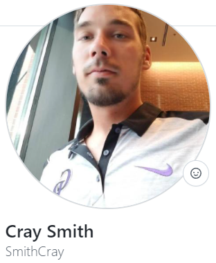

 

# Code  -  Companion

## 🧐 **Description:**

[Code-Companion]("add deployed") is a web app that allows Users to team up with people around the world to work on coding projects and share their experience. Our application allows you to post projects you are looking for partners on, join projects other users have posted. User's can also build a custom profile which lets them list all of their relevant skills, accomplishments, and years/months of experience. In addition projects also have specifics on skills/experience as well as what language/stack they are using and or looking for.

 

## 🛣️ **Road to Success:**

#

**Challenges;**

**Successes;**

 

### **User Story:**

 

As a User

        I want a website I can go to as a new or experienced programmer to find people to partner with and work on various coding projects with others.

Then

        I want a list of projects other users are looking for teammates to help create with specifics on language/stack as well as an option to post new projects you are looking for team members on.

So that

        I can continue learning and growing my skill set and network with other programmers that can help mentor me or I can help mentor them depending on experience level.

 

### 🖼️ **Preview:**

#

 

GitHub Repo:
 
🔗 https://github.com/SmithCray/Code-Companion

Heroku Deployed:
 
⚛️ (add deployed link here)

 

## 🎈 **Meet The Team:**

#

### **Collin Kerr**

GitHub Link: https://github.com/collink91

 

### **Lauren Buchholz**

GitHub Link: https://github.com/L-Buchholz

 

### **Matt Grogan**

GitHub Link: https://github.com/mattgrogandev

 

### **Cray Smith**

GitHub Link: https://github.com/SmithCray

 

### **Kerry Eames**

GitHub Link: https://github.com/KerryEames-Vris

 

## 🎉 **Acknowledgements:**

#

- 🏆 Our bootcamp instructor & TA, Ben Machock & Zac Stowell were a huge help throughout the project in pointing us in the right direction.

 

## Copyright (c) [2022] [ Code  -  Companion ]

#

Permission is hereby granted, free of charge, to any person obtaining a copy
of this software and associated documentation files (the "Software"), to deal
in the Software without restriction, including without limitation the rights
to use, copy, modify, merge, publish, distribute, sublicense, and/or sell
copies of the Software, and to permit persons to whom the Software is
furnished to do so, subject to the following conditions:

The above copyright notice and this permission notice shall be included in all
copies or substantial portions of the Software.

THE SOFTWARE IS PROVIDED "AS IS", WITHOUT WARRANTY OF ANY KIND, EXPRESS OR
IMPLIED, INCLUDING BUT NOT LIMITED TO THE WARRANTIES OF MERCHANTABILITY,
FITNESS FOR A PARTICULAR PURPOSE AND NONINFRINGEMENT. IN NO EVENT SHALL THE
AUTHORS OR COPYRIGHT HOLDERS BE LIABLE FOR ANY CLAIM, DAMAGES OR OTHER
LIABILITY, WHETHER IN AN ACTION OF CONTRACT, TORT OR OTHERWISE, ARISING FROM,
OUT OF OR IN CONNECTION WITH THE SOFTWARE OR THE USE OR OTHER DEALINGS IN THE
SOFTWARE.
